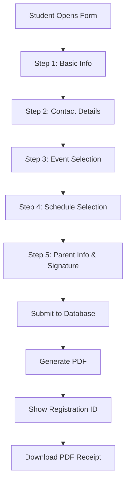

# State Team Registration System

## Overview
This is a **simplified registration form** extracted from the full student portal system. It collects state team and backup team registrations without requiring student login or payment processing.

## Features

### ✅ What's Included:
- **5-Step Registration Form**
  1. Basic student information (Name, IC, Age, School)
  2. Contact details (Phone, Email, Status)
  3. Event selection (Group A & Group B events)
  4. Training schedule selection (WSA, PC2, Chinwoo locations)
  5. Parent information & digital signature

- **Digital Signature Capture**
  - Canvas-based signature pad
  - Touch and mouse support
  - Mobile-responsive

- **PDF Generation**
  - Automatic PDF creation with all registration details
  - Includes parent signature
  - Downloadable after submission

- **Modern UI/UX**
  - Clean, professional design
  - Progress indicator
  - Responsive for mobile/tablet/desktop
  - Chinese/English bilingual support

### ❌ What's NOT Included:
- Student portal login system
- Payment processing
- Invoice generation
- Attendance tracking
- Class management
- Monthly billing

## Files Structure

```
state/
├── register_form.html      # Main registration form (5-step wizard)
├── register.php            # Backend to save registration data
├── config.php              # Database configuration
├── database_schema.sql     # SQL to create registrations table
├── admin.html              # Admin panel to view registrations
└── README.md              # This file
```

## Setup Instructions

### 1. Database Setup

**Option A: Using phpMyAdmin**
1. Open phpMyAdmin
2. Select your database (or create a new one)
3. Go to SQL tab
4. Copy and paste the contents of `database_schema.sql`
5. Click "Go" to execute

**Option B: Using MySQL Command Line**
```bash
mysql -u your_username -p your_database < database_schema.sql
```

### 2. Configure Database Connection

Edit `config.php` with your database credentials:

```php
<?php
header('Content-Type: application/json');

$host = 'localhost';           // Your database host
$user = 'your_username';       // Your database username
$pass = 'your_password';       // Your database password
$db   = 'your_database_name';  // Your database name

$conn = new mysqli($host, $user, $pass, $db);

if ($conn->connect_error) {
    http_response_code(500);
    echo json_encode(['success' => false, 'error' => 'Database connection failed']);
    exit;
}

$conn->set_charset('utf8mb4');
?>
```

### 3. Upload Files to Server

Upload all files to your web server:
- If using cPanel: Use File Manager
- If using FTP: Upload to `public_html` or your domain folder
- If using hosting panel: Upload to web root directory

### 4. Test the Registration Form

1. Open your browser and navigate to:
   ```
   https://yourdomain.com/register_form.html
   ```

2. Fill out the registration form:
   - Enter student details
   - Select events
   - Choose training schedules (minimum 2 required)
   - Sign with parent signature
   - Submit

3. You should see a success message with a registration ID like: `STATE-2026-0001`

### 5. View Registrations (Admin)

Open the admin panel:
```
https://yourdomain.com/admin.html
```

You can:
- View all registrations
- Search by name, IC, or email
- Filter by status (State Team / Backup Team)
- Download registration data

## Registration Flow



## Data Collected

The registration form collects:

| Field | Required | Type | Example |
|-------|----------|------|----------|
| English Name | ✅ | Text | Tan Ah Meng |
| Chinese Name | ❌ | Text | 陈阿明 |
| IC Number | ✅ | Text | 100215-05-1234 |
| Age (2026) | ✅ | Auto-calculated | 16 |
| School | ✅ | Dropdown | SJK(C) PUAY CHAI 2 |
| Status | ✅ | Radio | State Team / Backup Team |
| Phone | ✅ | Text | 012-345 6789 |
| Email | ✅ | Email | parent@example.com |
| Events | ✅ | Checkboxes | B组-长拳, A组-剑 |
| Schedule | ✅ | Checkboxes | Sunday 10am-12pm, Tuesday 8pm-10pm |
| Parent Name | ✅ | Text | Mr. Tan |
| Parent IC | ✅ | Text | 750815-05-5678 |
| Signature | ✅ | Canvas | [Digital signature image] |

## Training Locations

### 1. Wushu Sport Academy (WSA)
- **Address:** Bandar Bukit Puchong
- **Schedules:**
  - Sunday 10:00 AM - 12:00 PM
  - Sunday 12:00 PM - 2:00 PM

### 2. SJK(C) Puay Chai 2 (PC2)
- **Address:** Bandar Utama
- **Schedules:**
  - Tuesday 8:00 PM - 10:00 PM
  - Wednesday 8:00 PM - 10:00 PM

### 3. Stadium Chinwoo
- **Address:** Kuala Lumpur
- **Schedules:**
  - Sunday 2:00 PM - 4:00 PM

## Requirements for State/Backup Team

⚠️ **Important:** State team and backup team athletes must select **at least 2 training schedules**.

This is enforced in the form validation at Step 4.

## Technical Requirements

### Server Requirements:
- PHP 7.4 or higher
- MySQL 5.7 or higher (or MariaDB 10.2+)
- Apache/Nginx web server
- SSL certificate recommended (for HTTPS)

### Browser Support:
- Chrome 90+
- Firefox 88+
- Safari 14+
- Edge 90+
- Mobile browsers (iOS Safari, Chrome Mobile)

### External Libraries Used:
- **Tailwind CSS** (via CDN) - UI framework
- **Font Awesome 6** (via CDN) - Icons
- **SweetAlert2** (via CDN) - Beautiful alerts
- **jsPDF** (via CDN) - PDF generation
- **html2canvas** (via CDN) - HTML to canvas conversion

## Security Considerations

1. **Input Validation:** All inputs are validated on both client and server side
2. **SQL Injection Protection:** Uses prepared statements with parameterized queries
3. **XSS Protection:** Inputs are sanitized before storage
4. **HTTPS Recommended:** Use SSL certificate for secure data transmission
5. **Database Backups:** Regular backups recommended for registration data

## Customization

### Changing Colors/Branding:
Edit the CSS in `register_form.html`:
```css
/* Primary color (amber/yellow) */
--primary: #fbbf24;

/* Dark background */
--dark: #1e293b;

/* Success green */
--success: #16a34a;
```

### Adding/Removing Events:
Edit the event checkboxes in Step 3 of `register_form.html`

### Modifying Training Schedules:
Edit the schedule checkboxes in Step 4 of `register_form.html`

## Support & Troubleshooting

### Common Issues:

**1. Database Connection Failed**
- Check `config.php` credentials
- Verify database exists
- Check database user permissions

**2. Registration Submission Fails**
- Check browser console for errors
- Verify `register.php` has write permissions
- Check database table exists

**3. PDF Not Generating**
- Check internet connection (CDN libraries)
- Verify jsPDF and html2canvas are loading
- Check browser console for errors

**4. Signature Not Working**
- Ensure JavaScript is enabled
- Try different browser
- Check touch events on mobile

## Migration from Student Portal

This simplified form was extracted from the full `MlxySF/student` repository. Key differences:

| Feature | Student Portal | State Registration |
|---------|---------------|--------------------|
| Login System | ✅ Yes | ❌ No |
| Payment Processing | ✅ Yes | ❌ No |
| Invoice System | ✅ Yes | ❌ No |
| Attendance Tracking | ✅ Yes | ❌ No |
| Registration Form | ✅ Complex (7 steps) | ✅ Simple (5 steps) |
| PDF Generation | ✅ Yes | ✅ Yes |
| Database Storage | ✅ Multiple tables | ✅ Single table |

## License

This registration system is for internal use by Wushu Sport Academy for managing state team registrations.

## Version History

- **v1.0.0** (2025-12-18)
  - Initial release
  - Extracted from student portal system
  - Simplified 5-step registration
  - PDF generation with signature
  - Admin panel for viewing registrations

---

**Built for:** Wushu Sport Academy State Team 2026  
**Extracted from:** MlxySF/student repository  
**Created:** December 2025
